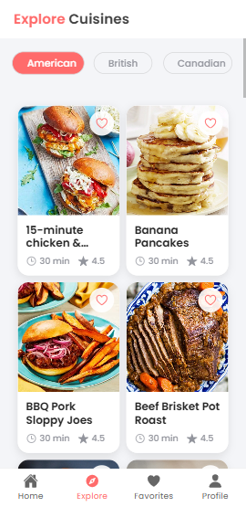
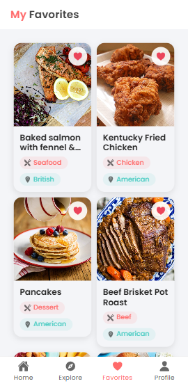
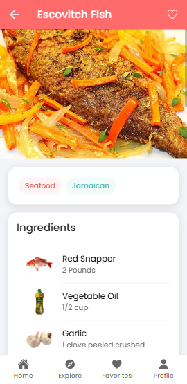
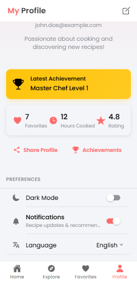

# Recipe App - Application de Recettes Mobile


*Page d'accueil avec recherche de recettes et recette du jour mise en avant*


*Page d'exploration permettant de découvrir des recettes par région et type de cuisine*


*Page des favoris affichant les recettes sauvegardées par l'utilisateur*


*Page détaillée d'une recette avec les ingrédients, instructions et possibilité d'ajouter aux favoris*


*Page de profil permettant de personnaliser les paramètres de l'application*


## 📱 Aperçu

Une application mobile de recettes développée avec Ionic et Angular, utilisant l'API TheMealDB. Cette application permet aux utilisateurs de découvrir, rechercher et sauvegarder leurs recettes préférées avec une interface utilisateur élégante et intuitive.

## ✨ Fonctionnalités

- 🔍 Recherche de recettes en temps réel
- 📂 Navigation par catégories de cuisine
- 🌍 Exploration des cuisines du monde
- ❤️ Système de favoris
- 🌓 Mode sombre/clair
- 👤 Profil utilisateur personnalisable

## 🛠 Technologies Utilisées

- Ionic Framework
- Angular
- TypeScript
- SCSS
- TheMealDB API
- Ionic Storage

## 📋 Prérequis

- Node.js 
- npm
- Ionic CLI
- Angular CLI

## 🚀 Installation

1. Clonez le dépôt :
```bash
git clone https://github.com/hatemslimani/recipe.git
```

2. Installez les dépendances :
```bash
cd recipe
npm install
```

3. Lancez l'application en mode développement :
```bash
ionic serve
```